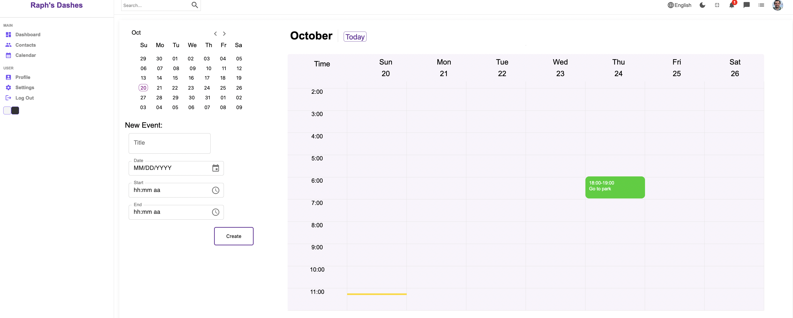
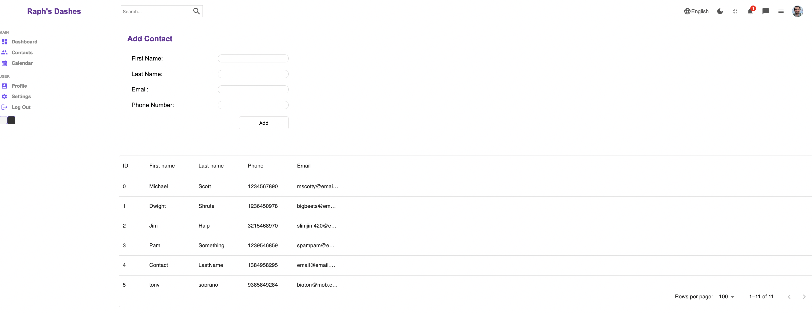
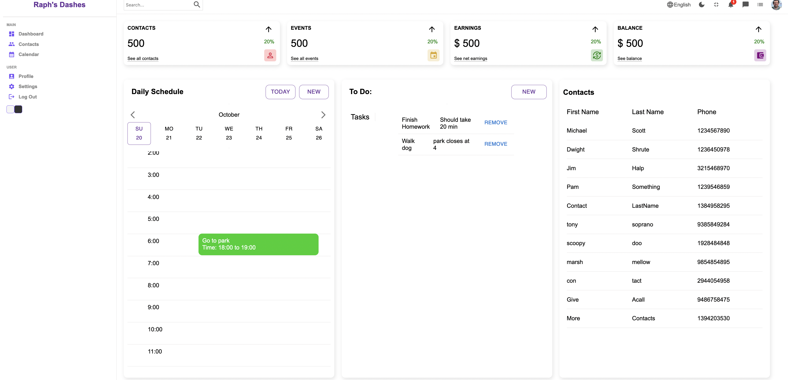

# Raph's Dashes: A Personal Dashboard App

## Overview

This web application functions as a personal dashboard for users to streamline their daily life. It does so through integration of a calendar, contacts list, and to-do list all in one place, while utilizing modern web technologies including React for the front end, SaSS for styling, and Django Rest Framework for the back end.

## Features

- **Custom Built Calendar**: While many apps use an external calendar library, this project uses a custom-built calendar using JSX and CSS. The calendar displays events and their times and includes a time-bar to indicate the current day and time.

- **Contact Management**: All contacts can be managed in one place, storing names, emails, and phone numbers.

- **To-Do List**: An integrated to-do list lets users plan and prioritze day to day tasks

## Tech Stack

- **Front End**: React, SaSS
- **Back End**: Django Rest Framework

## Future Enhancements

- **Robust Authentication**: This app currently uses a simple authentication system using local storage. Current plans include a transition to a more secure system using HttpOnly cookies and JWT refresh tokens

- **Google Calendar Integration**: Users will have the option in the future to link the app to their Google Calendar, providing seamless updates across platforms

## Getting Started

- Clone the repository
- Install front end dependencies
- Set up python virtual environment and install back end dependencies
- Run the application
